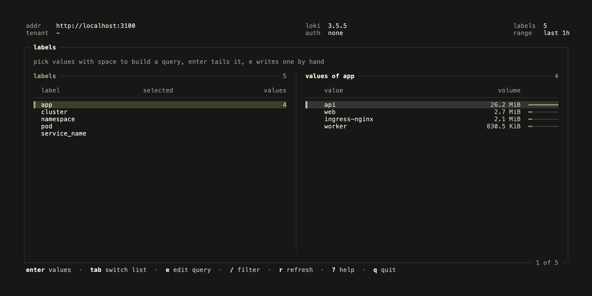
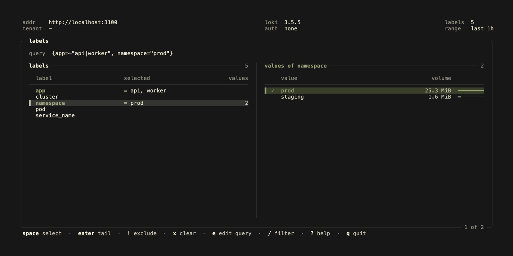
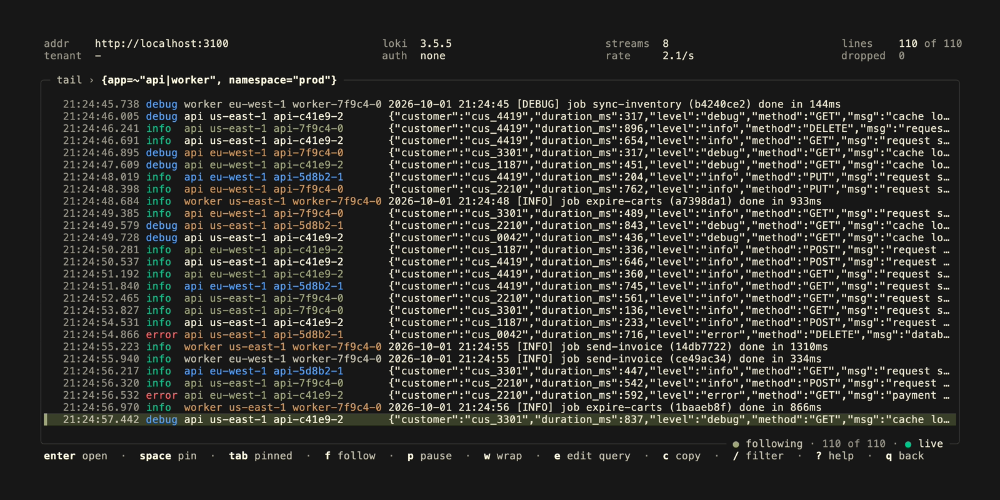
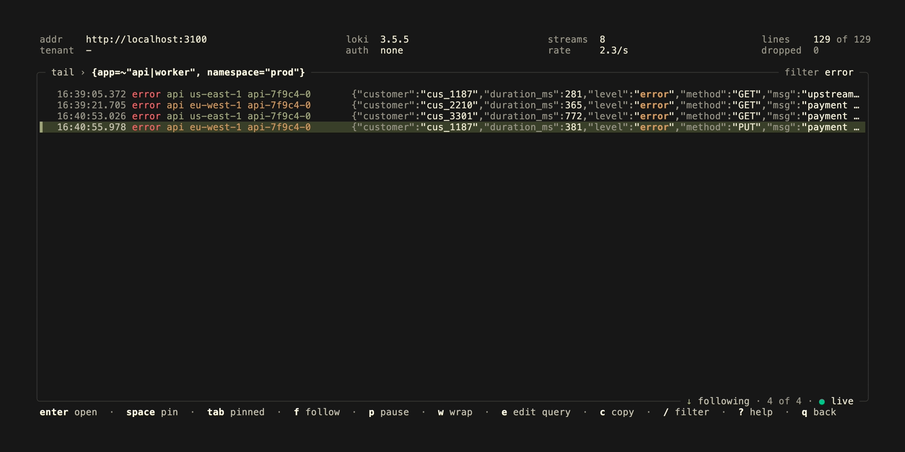
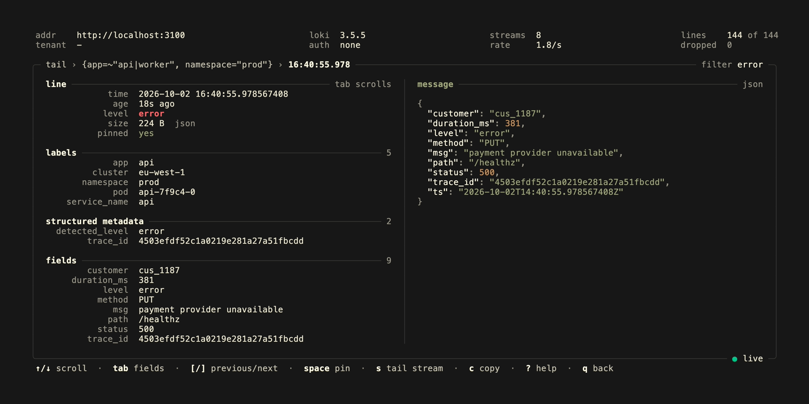

<p align="center">
  <a href="https://kontrolplane.dev">
    
  </a>
</p>

`stdout` is a terminal user interface (tui) application for following `loki` logs. It is a live `logcli query --tail` that you can steer while it runs. Build a query by picking labels and their values, follow the lines as they arrive, filter and highlight what is on screen, pin the lines worth keeping, and open any line to read its labels, structured metadata and fields.



## views

- `labels`: label names and their values, with how much each value ingested. Values are scoped to what is already picked, so the query is built with selections rather than typing
- `tail`: the live tail, with the level and the labels that tell the streams apart next to every line. JSON and logfmt lines are tinted so their keys recede behind the values and the message stands out. You can filter, highlight, pin, wrap, pause, jump between warnings and errors, and scroll back past the start into older lines. Scrolled away from the newest line, the frame counts the lines that came in since
- `line`: the time, level, stream labels, structured metadata and parsed fields of one line, with JSON indented and highlighted

The header shows the server, the tenant, the Loki version, and while tailing the number of streams, the rate in lines per second, the lines held and the lines the server dropped.






## keybindings

**labels**

- `↑`, `k`, `↓`, `j`: move
- `tab`, `←`, `→`: switch between the labels and the values
- `space`: select the value under the cursor, more values of one label make a regex matcher
- `!`: exclude the selected values of the label instead (`!=`, `!~`)
- `x`, `X`: clear the label, clear everything
- `enter`: on a label its values, on a value tail the selection (the value under the cursor if nothing is selected)
- `e`: write or edit the query by hand, any LogQL log query works
- `/`: filter the list
- `r`: refresh the labels
- `q`: quit

**tail**

- `↑`, `↓`, `pgup`, `pgdn`: move; `↑` on the oldest line loads the lines before it
- `g`, `G`: oldest/newest line
- `n`, `N`: next/previous warning or error
- `enter`: open the line
- `space`: pin the line, `tab` shows only the pinned lines
- `f`: follow the newest line, or stop following
- `p`: pause, new lines are held until you resume
- `w`: wrap long lines, between words where it can
- `l`: show or hide the labels column
- `/`: filter the lines on screen
- `e`: edit the query, which restarts the tail
- `s`: tail only the stream of the line under the cursor
- `c`: copy the line
- `ctrl+l`: clear the lines, the tail goes on
- `esc`: clear the filter, leave the pinned view, then back to the labels
- `q`: back to the labels
- `?`: help
- `ctrl+c`: quit

**line**

- `↑`, `↓`, `g`, `G`: scroll
- `tab`: scroll the labels and fields instead of the message, when there are more than fit
- `[`, `]`: previous/next line
- `space`: pin
- `s`: tail only this line's stream
- `c`: copy the line
- `q`, `esc`: back to the tail

## filtering

There are two kinds of filter. `/` filters the lines already on screen, as you type and without asking Loki for anything:

| filter       | shows                                              |
| ------------ | -------------------------------------------------- |
| `timeout`    | lines containing `timeout`, in any case            |
| `/5\d\d$/`   | lines matching the regular expression              |
| `!healthz`   | lines that do not contain `healthz`                |

Matches are highlighted, and lines that arrive later are filtered too. To change what Loki sends, edit the query with `e`, for example `{app="api"} |= "error" | json | status >= 500`.

## how it works

The tail is a websocket to `/loki/api/v1/tail`, the same one `logcli query --tail` uses. It starts with the newest `--limit` lines of the last `--since`. If the connection drops, or the server ends the tail after its `tail_max_duration`, `stdout` reconnects with backoff and resumes after the last line it saw. Lines are not shown twice, and up to 5000 missed lines are filled in. If Loki refuses the query, as it does for metric queries, the tail stops and shows the reason.

Lines are kept in time order, and late ones are put in their place. The oldest are dropped once more than `--buffer` lines are held. Moving up past the oldest line asks `/loki/api/v1/query_range` for the `--since` before it.

The volumes in the label picker come from `/loki/api/v1/index/volume`. This needs Loki 3 with `volume_enabled: true`. Without it the values are listed without volumes. With Loki 3, structured metadata and parsed labels are shown apart from the stream labels.

Levels come from the `level`, `detected_level` or `severity` label, the structured metadata, a JSON or logfmt field, or a level word such as `[WARN]` near the start of the line.

## installation

```bash
brew install kontrolplane/tap/stdout
```

or with go, which requires [go](https://go.dev/) 1.26 or later:

```bash
go install github.com/kontrolplane/stdout@latest
```

Prebuilt binaries for linux, macos and windows are attached to the [GitHub releases](https://github.com/kontrolplane/stdout/releases), together with a `checksums.txt` to verify the download.

A container image for linux/amd64 and linux/arm64 is published to `ghcr.io/kontrolplane/stdout`. Releases are tagged with their version and `latest`, and `main` tracks the latest commit on main:

```bash
docker run --rm -it --network host ghcr.io/kontrolplane/stdout:latest --addr http://127.0.0.1:3100
```

## connecting

`stdout` takes the same flags and environment variables as [logcli](https://grafana.com/docs/loki/latest/query/logcli/), so an environment set up for logcli works as is. Flags take precedence over the environment.

| flag                  | environment variable     | description                                                         |
| --------------------- | ------------------------ | ------------------------------------------------------------------- |
| `--addr`              | `LOKI_ADDR`              | Loki server address, defaults to `http://localhost:3100`            |
| `--org-id`            | `LOKI_ORG_ID`            | tenant, sent as `X-Scope-OrgID`                                     |
| `--username`          | `LOKI_USERNAME`          | basic auth username                                                 |
| `--password`          | `LOKI_PASSWORD`          | basic auth password, prefer the environment variable                |
| `--bearer-token`      | `LOKI_BEARER_TOKEN`      | bearer token, prefer the environment variable                       |
| `--bearer-token-file` | `LOKI_BEARER_TOKEN_FILE` | file holding the bearer token                                       |
| `--auth-header`       | `LOKI_AUTH_HEADER`       | header the credentials are sent in, defaults to `Authorization`     |
| `--ca-cert`           | `LOKI_CA_CERT_PATH`      | certificate authority to verify the server with                     |
| `--cert`              | `LOKI_CLIENT_CERT_PATH`  | client tls certificate, requires `--key`                            |
| `--key`               | `LOKI_CLIENT_KEY_PATH`   | client tls key, requires `--cert`                                   |
| `--tls-skip-verify`   | `LOKI_TLS_SKIP_VERIFY`   | do not verify the server certificate                                |
| `--since`             |                          | how far back labels, the first lines and each page of older lines reach, defaults to `1h` |
| `--limit`             |                          | lines the tail starts with, defaults to `100`                       |
| `--buffer`            |                          | lines kept in memory, defaults to `10000`                           |
| `--theme`             |                          | `auto`, the default, follows the terminal; `dark` and `light` paint their own background |
| `--debug`             |                          | write debug logs to `debug.log`                                     |
| `--version`           |                          | print the version and exit                                          |
| `--help`, `-h`        |                          | print the flags and exit                                            |

Pass a query to start tailing right away, skipping the label picker:

```bash
stdout '{namespace="prod", app="api"} |= "error"'
stdout --addr https://logs.example.com --org-id team-a --since 15m '{cluster="eu-west-1"}'
```

The tail needs a websocket to Loki. A gateway or proxy in front of it has to pass websocket upgrades on `/loki/api/v1/tail`.

## development

stdout uses a local Loki running in Docker, and a generator that pushes made up logs of a few services: JSON from an api, logfmt from a web frontend, plain text from a worker and access logs from an ingress.

- [docker](https://www.docker.com/)
- [earthly](https://earthly.dev/)
- [vhs](https://github.com/charmbracelet/vhs) with `ffmpeg` and `ttyd`, only to record the readme gif and screenshots
- [go](https://go.dev/) 1.26+

**start loki, push an hour of history and build**

```bash
earthly +dev && ./build/kontrolplane/stdout
```

**keep new lines coming, in another terminal**

```bash
earthly +generate
```

The generator also runs as `go run ./seed`; see `go run ./seed -h` for its rate and history. Remove the `volume` directory after `docker compose down` to start from scratch.

To update the gif and screenshots in this readme, with Loki and the generator running:

```bash
earthly +vhs
```

The tests serve a fake Loki over `httptest`, including the websocket tail, so they do not need Docker:

```bash
go test ./...
```

## contributors

[//]: kontrolplane/generate-contributors-list

<a href="https://github.com/levivannoort"></a>

[//]: kontrolplane/generate-contributors-list

</br>

<p align="center">
  
</p>
